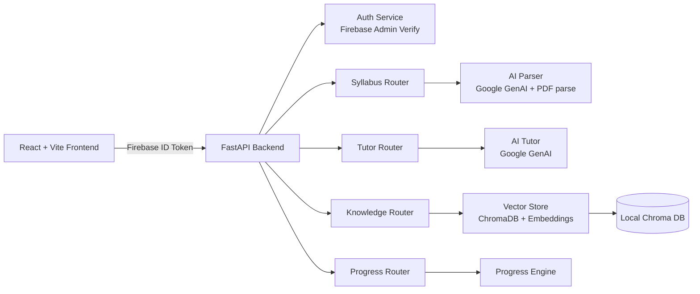

# EngiFlow

> AI-powered study flow for engineering students.
> Upload syllabus + resources, unlock topics with quizzes, and learn through an interactive tutor.

## Why EngiFlow

EngiFlow combines four things in one loop:

- Structured learning path from a syllabus PDF
- Personal knowledge base from uploaded textbooks/notes
- AI tutor for explanations, deep dives, and generated notes
- Progress engine that gates and unlocks topics based on quiz performance

## Core Features

- Syllabus ingestion: parse a syllabus document into a topic tree
- Knowledge indexing: upload reference docs and search semantically
- Tutor chat: contextual responses using your syllabus and knowledge base
- Study notes: generate concise topic notes
- Progress tracking: submit quiz results and unlock next topics
- Firebase auth: protected API routes tied to user identity

## Architecture



## Tech Stack

- Frontend: React 19, Vite, Tailwind CSS, D3, ReactFlow, Firebase JS SDK
- Backend: FastAPI, Pydantic, Firebase Admin SDK, ChromaDB, PyMuPDF, Google GenAI SDK
- Data: local ChromaDB store and in-memory user progress model

## Project Layout

```text
engiflow/
  backend/
    main.py
    routers/
    services/
  frontend/
    src/
    public/
  docs/
    syllabus_schema.json
```

## Quick Start

### 1) Clone

```bash
git clone https://github.com/chet-08/EngiFlow.git
cd EngiFlow
```

### 2) Backend Setup (FastAPI)

```bash
cd backend
python -m venv venv
# Windows
venv\Scripts\activate
# macOS/Linux
# source venv/bin/activate

pip install fastapi uvicorn pydantic firebase-admin chromadb pymupdf google-genai python-multipart
```

Create required environment variables:

```bash
# Windows PowerShell
$env:GEMINI_API_KEY="your_key_here"
```

Firebase Admin credentials:

- Place your service account JSON at `backend/firebase-credentials.json`
- This file is gitignored by default

Run backend:

```bash
uvicorn main:app --reload --host 127.0.0.1 --port 8000
```

API docs:

- Swagger: http://127.0.0.1:8000/docs
- Health: http://127.0.0.1:8000/health

### 3) Frontend Setup (React + Vite)

```bash
cd ../frontend
npm install
npm run dev
```

Frontend dev URL:

- http://127.0.0.1:5173

## API Surface

Main route groups:

- `/syllabus`
  - `POST /upload-syllabus`
  - `GET /my-syllabus`
- `/knowledge`
  - `POST /upload-textbook`
  - `DELETE /clear-my-knowledge`
- `/tutor`
  - `POST /chat`
  - `POST /generate-note`
  - `POST /stream-subtopic`
- `/progress`
  - `POST /submit-quiz`
  - `GET /status`

## Security Notes

- Keep `backend/firebase-credentials.json` private
- Keep API keys in environment variables, not hardcoded in source
- Rotate any exposed keys before production deployment

## Roadmap

- Move frontend Firebase config to `.env` variables
- Add persistent database for progress and profile state
- Add tests for router and service layers
- Add Docker and one-command local startup

## License

MIT (see `LICENSE`)
